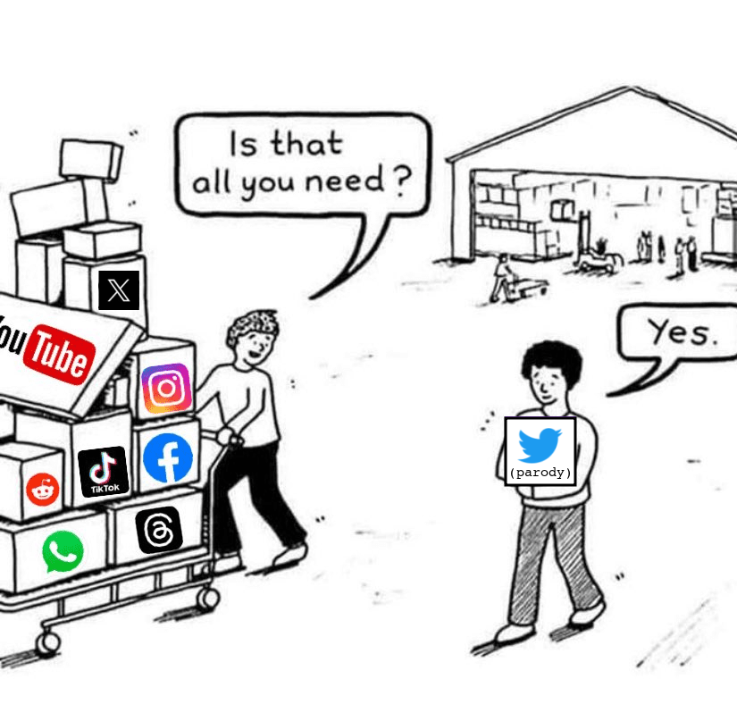
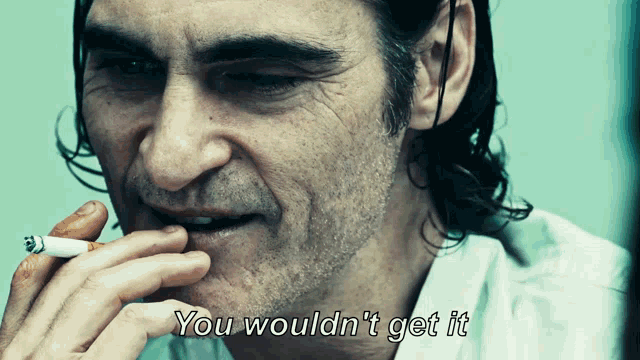
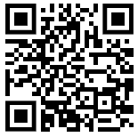

E a pomba voltou a ele à tarde; e eis, arrancada, uma folha de oliveira no seu bico; e conheceu Noé que as águas tinham minguado de sobre a terra. 
Gênesis 8:11

# Twitter (Parody)
 _don't thread on Twitter_

## Parody

what's so funny about this parody?

## Install
not yet

## Still in development
_Ebenézer_
I got this far:

## How the parody is implemented technically
angular (scss + rxjs) + nostr-tools

## Donate
Do you want more protests in favor of free speech, freedom of software and freedom of work similar to this one?

This client nostr is a demonstration of a fraction of my power, as I have no funding other than my goodwill, with a contribution in satoshis you help me fund other products.

Any open source that has its code physically decentralized around the world is likely to be a perpetual service to every human being with access to technology.

There's still a lot of work to do.

Lighting donate: <a href="lightning:peevedbeer57@walletofsatoshi.com">lightning:peevedbeer57@walletofsatoshi.com</a>

Bitcoin onchain donate: <a href="bitcoin:bc1qrm99lmmpwk7zsh7njpgthw87yvdm38j2lzpq7q">bc1qrm99lmmpwk7zsh7njpgthw87yvdm38j2lzpq7q</a>

## Contribute
[CONTRIBUTE.md](./CONTRIBUTE.md)